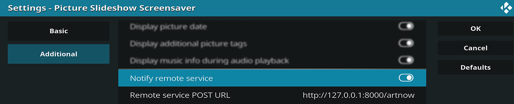

# artnow

the companion server for the Picture Slideshow's ***[Remote Notification](https://forum.kodi.tv/showthread.php?tid=154032&pid=2618126#pid2618126)***



### Description

The [Picture Slideshow Screensaver](https://github.com/XBMC-Addons/screensaver.picture.slideshow) turns [Kodi](https://github.com/xbmc/xbmc) into an amazing Art Gallery. For purists who want their view unspoiled by metadata, you can now find out what is on display by asking [Alexa](https://www.amazon.com/Amazon-Echo-And-Alexa-Devices/b?ie=UTF8&node=9818047011).
  
This server provides:
- a HTTP listener to receive notification from Kodi
- a REST interface to access file paths for the current and last image
  (for use by a remote Alexa endpoint)
- an ad hoc Alexa endpoint to directly serve the Amazon Echo

### Requirement 
  
- Picture Slideshow Screensaver with the [Remote Notification patch](https://github.com/XBMC-Addons/screensaver.picture.slideshow/pull/7)
- access to [Alexa Development Portal](https://developer.amazon.com/edw/home.html#/skills)

  
### Instructions
  
```Shell
#    compile
$ swift build -c release
#    (binary at ./.build/release/artnow)

#    generate SSL certificates for Alexa endpoint
$ mkdir sslcert
$ openssl genrsa -out sslcert/private.pem 1024
$ openssl req -new -x509 -key sslcert/private.pem -out sslcert/adhoc-alexa.cer -days 600
#    (specify the exact hostname of your endpoint in CN)

#   start in the same location as the directory sslcert
$ ./.build/release/artnow 
#   (configure Alexa Skill in the Amazon Development Portal)
```

